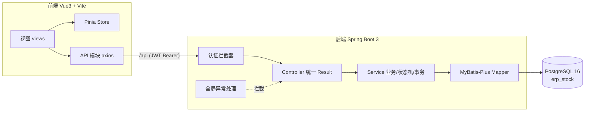
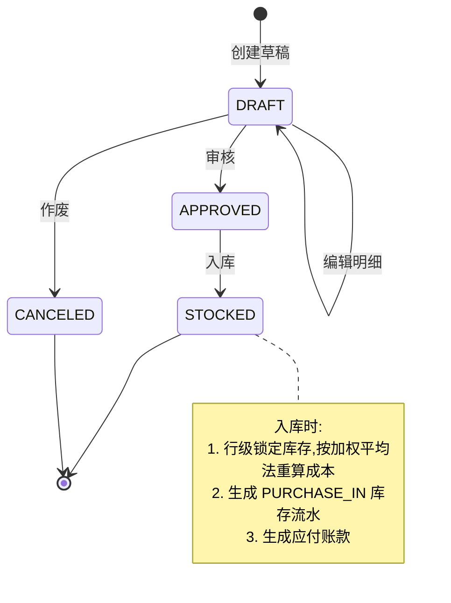
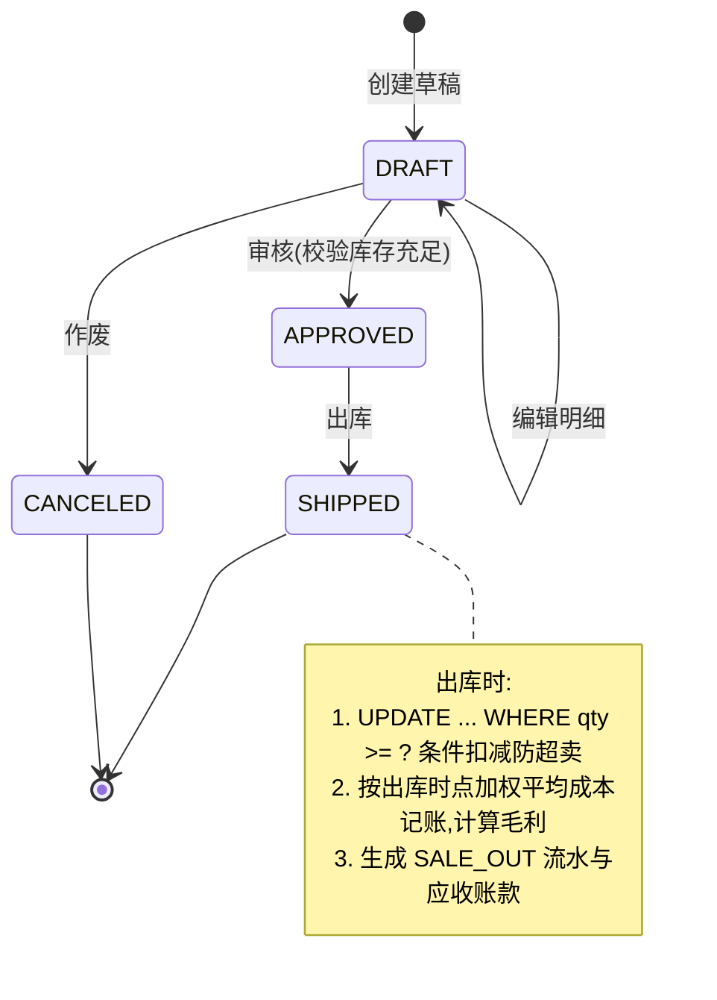
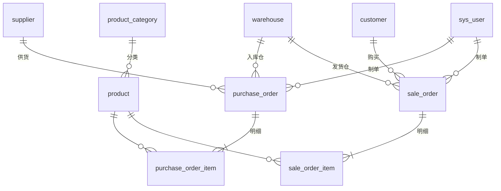
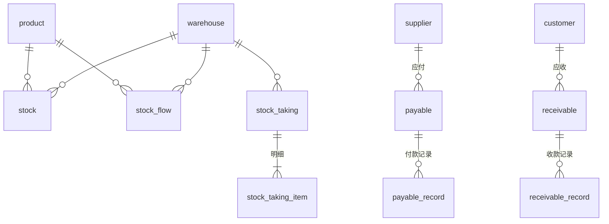

# 云仓进销存 ERP 管理系统

面向中小贸易企业的进销存一体化管理系统,覆盖 **基础资料 → 采购入库 → 销售出库 → 库存核算 → 财务核销 → 报表看板** 完整业务闭环。前后端分离架构,内置贴近真实经营场景的种子数据(近 30 天 30+ 采购单、50+ 销售单、300+ 库存流水),开箱即可演示。

## 项目亮点

- **严谨的单据状态机**:采购/销售单均为 `草稿 → 已审核 → 已出入库` 三段式流转,只有审核通过的单据才能执行出入库,草稿可作废,每一步流转都有服务端状态校验。
- **加权平均法成本核算**:采购入库实时重算加权平均成本,销售出库按出库时点成本记账并自动计算毛利,流水与库存口径严格一致(流水汇总 = 当前库存)。
- **库存不出负的双重保障**:出库采用 `UPDATE ... WHERE qty >= ?` 行级条件扣减(按影响行数判断),数据库层再加 `CHECK (qty >= 0)` 约束兜底,并发下也不会超卖。
- **工程化规范**:统一响应体 `Result<T>`、全局异常处理、Jakarta Validation 参数校验、MyBatis-Plus 分页插件、JWT 认证拦截器、BCrypt 密码存储。
- **角色化菜单**:管理员/采购员/销售员/仓管员四种角色,前端菜单与路由按角色动态过滤。
- **可视化看板**:核心指标卡 + 近 30 天销售采购双折线 + 热销 TOP10 柱状图 + 分类占比饼图 + 库存预警表格(ECharts)。

## 功能清单

| 模块 | 功能 |
| --- | --- |
| 基础资料 | 商品(编码/分类/单位/参考进销价/库存预警线)、三级商品分类树、供应商、客户、仓库 |
| 采购管理 | 采购订单(单头+明细行编辑、自动合计)、审核、作废、入库(加权平均成本 + 库存流水 + 应付账款) |
| 销售管理 | 销售订单(单头+明细行编辑)、审核(库存充足校验)、作废、出库(防超卖扣减 + 成本毛利核算 + 应收账款) |
| 库存管理 | 实时库存(仓库+商品维度,含库存金额)、库存流水(采购入库/销售出库/盘盈/盘亏)、库存盘点(账面快照→实盘录入→盈亏调整)、库存预警 |
| 财务简版 | 应付账款 + 付款登记、应收账款 + 收款登记(均支持部分核销、余额跟踪) |
| 报表看板 | 本月销售额/毛利/采购额/库存总额/应收应付余额指标卡、30 天趋势双折线、热销 TOP10、分类占比、库存预警 |
| 系统管理 | 用户管理(四种角色),菜单按角色区分 |

## 技术栈

| 层 | 技术 | 说明 |
| --- | --- | --- |
| 后端 | Spring Boot 3.3 (JDK 17) | Web / Validation |
| ORM | MyBatis-Plus 3.5 | `mybatis-plus-spring-boot3-starter`,分页插件 |
| 数据库 | PostgreSQL 16 | 外键 + 索引 + CHECK 约束,金额 `numeric(18,2)` |
| 认证 | JWT (jjwt 0.12) | 自研拦截器 + ThreadLocal 用户上下文 |
| 密码 | spring-security-crypto | BCrypt |
| 前端 | Vue 3 + TypeScript + Vite 5 | `<script setup>`,严格模式零 TS 报错 |
| UI | Element Plus | 经典后台布局(侧边菜单 + 顶栏) |
| 状态/路由 | Pinia + Vue Router | 路由守卫 + 角色过滤 |
| 图表 | ECharts 5 | 看板可视化 |

## 系统架构



## 核心业务流程

### 采购状态机



### 销售状态机



## 数据库 ER 图

### 基础资料与单据



### 库存与财务



完整表结构见 [docs/数据库设计.md](docs/数据库设计.md)。

## 快速开始

### 环境要求

- JDK 17、Maven 3.6+
- Node.js 18+(建议 20+)
- PostgreSQL 14+(默认连接 `127.0.0.1:5432`,用户 `postgres/postgres`)

### 1. 初始化数据库

```bash
# 创建数据库并导入表结构与种子数据(脚本可重复执行)
psql -h 127.0.0.1 -U postgres -c "CREATE DATABASE erp_stock ENCODING 'UTF8'"
psql -h 127.0.0.1 -U postgres -d erp_stock -v ON_ERROR_STOP=1 -f sql/init.sql
```

> Windows 下建议先设置 `set PGCLIENTENCODING=UTF8` 再执行,避免中文乱码。

### 2. 启动后端(端口 9102)

```bash
cd backend
mvn spring-boot:run
```

数据库连接信息在 `backend/src/main/resources/application.yml` 中修改。

### 3. 启动前端(端口 5302)

```bash
cd frontend
npm install
npm run dev
```

浏览器访问 <http://localhost:5302>,开发服务器已将 `/api` 代理到后端 9102。

### 默认账号(密码均为 `123456`)

| 用户名 | 角色 | 可见菜单 |
| --- | --- | --- |
| admin | 管理员 | 全部模块 |
| buyer01 | 采购员 | 看板、商品/分类/供应商、采购、库存查询、应付账款 |
| seller01 | 销售员 | 看板、商品/分类/客户、销售、库存查询、应收账款 |
| stocker01 | 仓管员 | 看板、商品/分类/仓库、采购/销售单据、库存(含盘点) |

## 目录结构

```
erp-stock/
├── README.md
├── sql/
│   └── init.sql                  # 建表 + 种子数据(可重复执行)
├── docs/
│   ├── 数据库设计.md
│   ├── API接口文档.md
│   ├── 部署指南.md
│   └── 业务流程说明.md
├── backend/                      # Spring Boot 3 后端
│   └── src/main/java/com/demo/erp/
│       ├── common/               # Result / 异常 / 用户上下文 / 单号工具
│       ├── config/               # MyBatis-Plus / Jackson / JWT / 拦截器
│       ├── controller/           # REST 接口(统一 Result)
│       ├── dto/                  # 请求 DTO(Jakarta Validation)
│       ├── entity/               # 实体(MyBatis-Plus 注解)
│       ├── mapper/               # Mapper(注解 SQL 联查/统计)
│       └── service/ + impl/      # 业务逻辑(状态机/事务/库存核算)
└── frontend/                     # Vue 3 + TS 前端
    └── src/
        ├── api/                  # 接口模块
        ├── layout/               # 后台布局(侧边菜单 + 顶栏)
        ├── router/               # 路由 + 守卫
        ├── stores/               # Pinia(认证状态)
        ├── utils/                # axios 封装 / 格式化字典
        └── views/                # 页面(看板/基础资料/采购/销售/库存/财务/系统)
```

## 文档索引

| 文档 | 内容 |
| --- | --- |
| [数据库设计.md](docs/数据库设计.md) | 18 张表结构、字段说明、索引与约束设计 |
| [API接口文档.md](docs/API接口文档.md) | 全部 REST 接口、请求/响应示例 |
| [部署指南.md](docs/部署指南.md) | 开发环境启动、生产构建与部署 |
| [业务流程说明.md](docs/业务流程说明.md) | 单据状态机、加权平均成本算法(含算例)、盘点与核销规则 |

## 常见问题

**Q: 登录提示"用户名或密码错误"?**
确认已执行 `sql/init.sql`(其中包含 BCrypt 加密的种子账号),默认密码均为 `123456`。

**Q: 前端请求 401?**
JWT 有效期默认 24 小时,过期后会自动跳转登录页重新登录;`erp.jwt.expire-hours` 可在 `application.yml` 调整。

**Q: 销售单审核报"库存不足"?**
审核会按发货仓库校验库存(同商品多行合并计算),请先通过采购入库补充库存,或在"实时库存"页确认对应仓库的现存量。

**Q: 为什么删除商品/分类失败?**
被单据、库存或子分类引用的数据不允许删除(外键约束 + 业务校验),这是有意为之的数据完整性保护。

**Q: 端口冲突怎么办?**
后端端口在 `application.yml` 的 `server.port`(默认 9102),前端端口与代理目标在 `frontend/vite.config.ts`(默认 5302)。

## License

本项目仅用于学习与技术演示。
