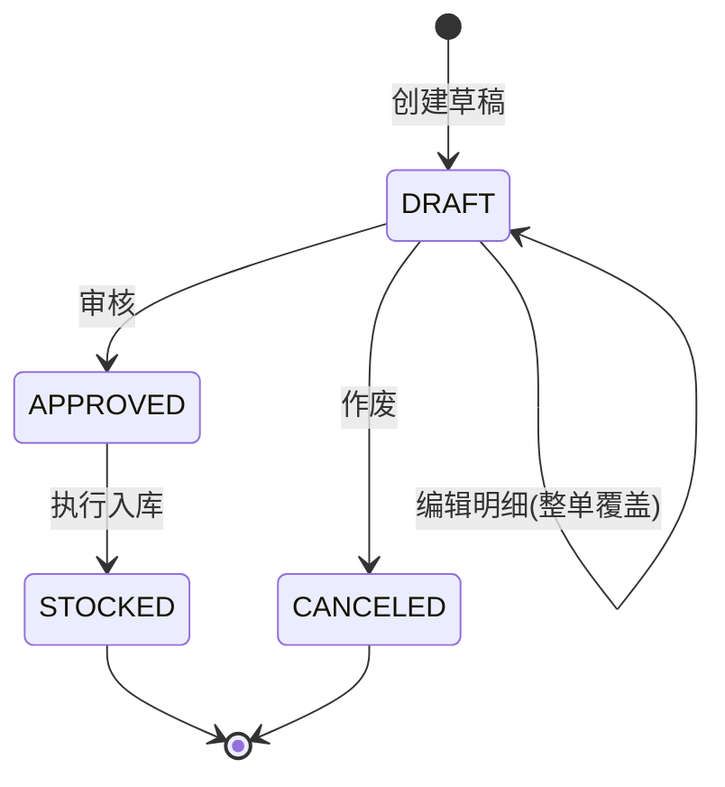
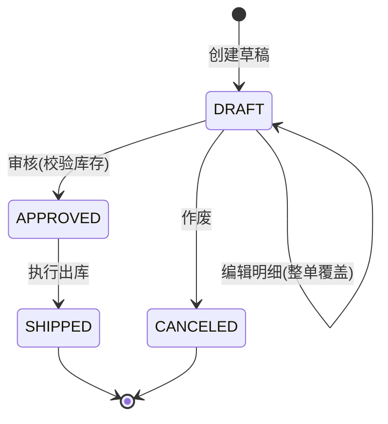
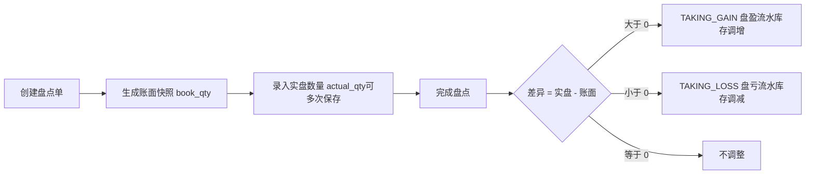

# 业务流程说明

本文档描述系统两条核心单据链(采购、销售)的状态机、库存成本核算算法(加权平均法)以及盘点与财务核销规则。

## 一、采购业务链

### 1.1 状态机



| 状态 | 含义 | 允许的操作 |
| --- | --- | --- |
| DRAFT 草稿 | 制单完成,未生效 | 编辑、审核、作废、删除 |
| APPROVED 已审核 | 单据生效,等待到货 | 入库 |
| STOCKED 已入库 | 货物入库完毕 | 只读 |
| CANCELED 已作废 | 单据废弃 | 删除 |

**关键约束**:

- 所有状态流转由服务端校验(`requireStatus`),非法流转返回业务异常,例如草稿直接入库会被拒绝:`仅已审核的采购单可执行入库(当前状态: DRAFT)`。
- 金额由服务端按明细重算(`金额 = 数量 × 单价`,合计逐行累加),不信任前端传入的合计值。
- 单号规则:`PO + yyyyMMdd + "-" + 4 位当日流水`,如 `PO20260901-0001`,按当日已有最大单号推算。

### 1.2 入库时发生了什么(同一事务)

1. 逐明细行 **行级锁定**(`SELECT ... FOR UPDATE`)对应仓库+商品的库存记录(无记录则初始化);
2. 按加权平均法重算成本并累加数量(见第三节);
3. 写入 `PURCHASE_IN` 库存流水(记录变动数量、变动后结存、采购单价);
4. 单据置为 `STOCKED` 并记录入库时间;
5. 按单据总额生成一条 **应付账款**(状态 `UNPAID`)。

## 二、销售业务链

### 2.1 状态机



**审核时的库存校验**:按发货仓库聚合校验(同一商品多行合并需求量),现存量不足直接拒绝审核,并明确提示缺哪个商品、现有多少、需要多少。

### 2.2 出库时发生了什么(同一事务)

1. 逐明细行执行 **条件扣减**:

   ```sql
   UPDATE stock SET qty = qty - ?
   WHERE warehouse_id = ? AND product_id = ? AND qty >= ?
   ```

   按影响行数判断:为 0 说明库存不足(可能被并发单据抢先扣走),整个事务回滚。数据库层另有 `CHECK (qty >= 0)` 约束兜底,**双重保证库存不出负**。
2. 读取扣减后的库存记录,以 **出库时点的加权平均成本** 作为该行成本单价,`成本金额 = 数量 × 成本单价`;
3. 写入 `SALE_OUT` 库存流水(变动数量为负);
4. 汇总成本,更新单头:`销售成本合计`、`毛利 = 销售金额 - 销售成本`;
5. 按单据总额生成一条 **应收账款**(状态 `UNRECEIVED`)。

> 审核已校验过库存,为什么出库还要再校验?因为审核与出库之间可能有其他单据先行出库,时点库存可能已变化。条件扣减是最终防线。

## 三、加权平均法成本核算(算例)

系统按 **移动加权平均法** 核算库存成本:每次入库都重算平均成本,出库不改变平均成本、只按当前平均成本结转。

```
新平均成本 = (原数量 × 原平均成本 + 入库数量 × 采购单价) / (原数量 + 入库数量)
```

平均成本保留 4 位小数(HALF_UP),金额保留 2 位小数。

### 算例

| 步骤 | 业务 | 计算 | 库存数量 | 平均成本 |
| --- | --- | --- | --- | --- |
| 1 | 期初为空 | - | 0 | 0 |
| 2 | 采购入库 100 件 @ 50.00 | (0×0 + 100×50) / 100 | 100 | 50.0000 |
| 3 | 采购入库 50 件 @ 56.00 | (100×50 + 50×56) / 150 = 7800/150 | 150 | 52.0000 |
| 4 | 销售出库 60 件 @ 售价 70.00 | 成本 = 60 × 52.0000 = 3120.00 | 90 | 52.0000(不变) |
| 5 | 该销售单毛利 | 60×70 − 3120 = 4200 − 3120 | - | **毛利 1080.00** |
| 6 | 再采购 90 件 @ 48.00 | (90×52 + 90×48) / 180 = 9000/180 | 180 | 50.0000 |

对应到数据:

- 每一步出入库都会写一条 `stock_flow` 流水,`qty_change` 入库为正/出库为负,`qty_after` 为变动后结存 —— 因此任意时点满足:**某仓库某商品的流水 qty_change 之和 = stock 表当前数量**(种子数据同样满足该恒等式)。
- 销售明细行会固化出库时的 `cost_price` / `cost_amount`,历史单据的毛利不受后续成本波动影响。

## 四、库存盘点



- 创建盘点单时,对指定仓库当前所有库存记录生成账面快照;
- 完成盘点时,系统会 **以完成时点的实际库存重算账面数**(防止盘点期间发生出入库导致口径漂移),再按 `实盘 − 账面` 生成盈亏;
- 未录入实盘数量的行视为"未盘",不做调整;
- 盘盈/盘亏均按当前加权平均成本计量流水金额,**不改变平均成本**;
- 已完成的盘点单不可再修改。

## 五、财务核销

- 采购入库自动生成应付账款,销售出库自动生成应收账款,金额与单据总额一致,通过单号关联溯源;
- 付款/收款登记支持 **部分核销**,可多次登记,每次生成一条记录;
- 登记金额不得超过未付/未收余额(服务端校验);
- 状态自动维护:`未付款/未收款 → 部分核销 → 已结清`(累计核销金额达到总额时结清)。

## 六、库存预警

- 每个商品可配置 `warn_qty` 预警线(0 表示不预警);
- 预警口径为 **各仓库合计库存 < 预警线**;
- 看板与"库存预警"页展示预警商品、缺口数量与达成率,辅助补货决策。
